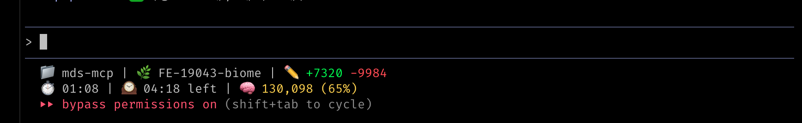
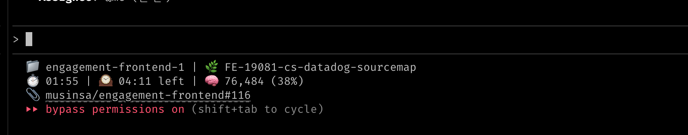

# cc-statusline

Custom statusline for Claude Code.


## Preview





## Features

- **Session Time**: Current session elapsed time
- **Block Timer**: Time remaining in 5-hour block (via ccusage)
- **Context %**: Current context window usage (updates immediately)
- **Session Tokens**: Cumulative token usage
- **Git Changes**: Staged/unstaged line counts
- **PR URL**: Clickable OSC 8 hyperlink
- **TrueColor**: Dynamic colors based on thresholds

## Installation

```bash
# 1. Clone
git clone https://github.com/say8425/cc-statusline.git ~/dev/cc-statusline
cd ~/dev/cc-statusline

# 2. Install dependencies
bun install

# 3. Configure Claude Code
# ~/.claude/settings.json
{
  "statusLine": {
    "type": "command",
    "command": "bun ~/dev/cc-statusline/src/index.ts",
    "padding": 0
  }
}
```

## Dependencies

- [Bun](https://bun.sh) - JavaScript runtime
- [ccusage](https://github.com/ryoppippi/ccusage) - Claude Code usage tracking
- [gh](https://cli.github.com) - GitHub CLI (optional, for PR URL)

## Color Thresholds

| Metric | Normal (white) | Warning (yellow) | Critical (red) |
|--------|----------------|------------------|----------------|
| Context % | < 50% | 50-80% | > 80% |
| Block Timer | > 10 min | 1-10 min | < 1 min |

## License

MIT
