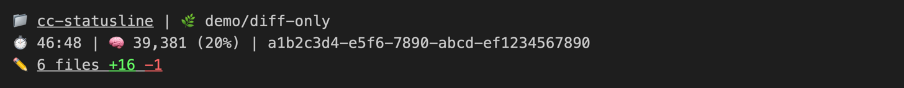
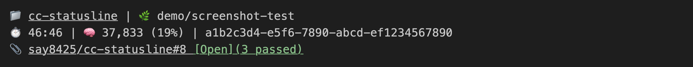
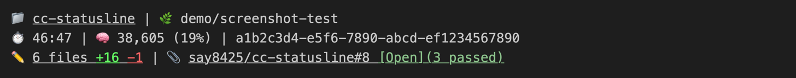
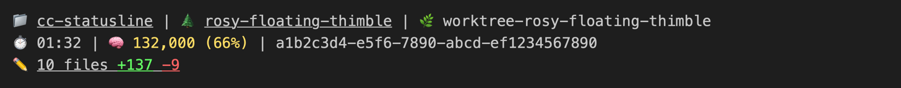
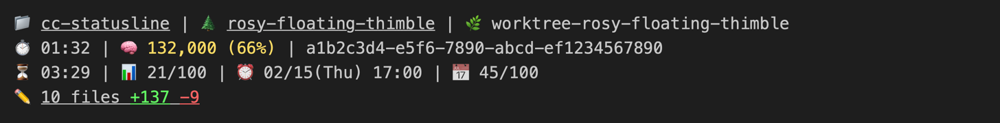
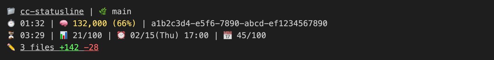
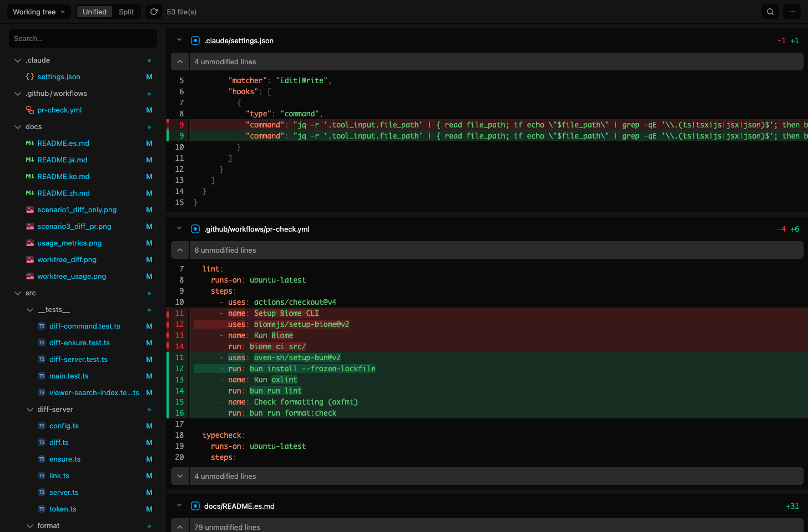
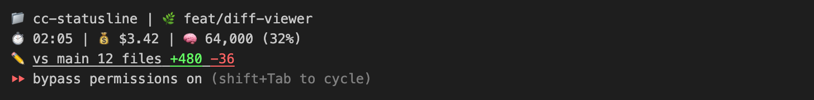
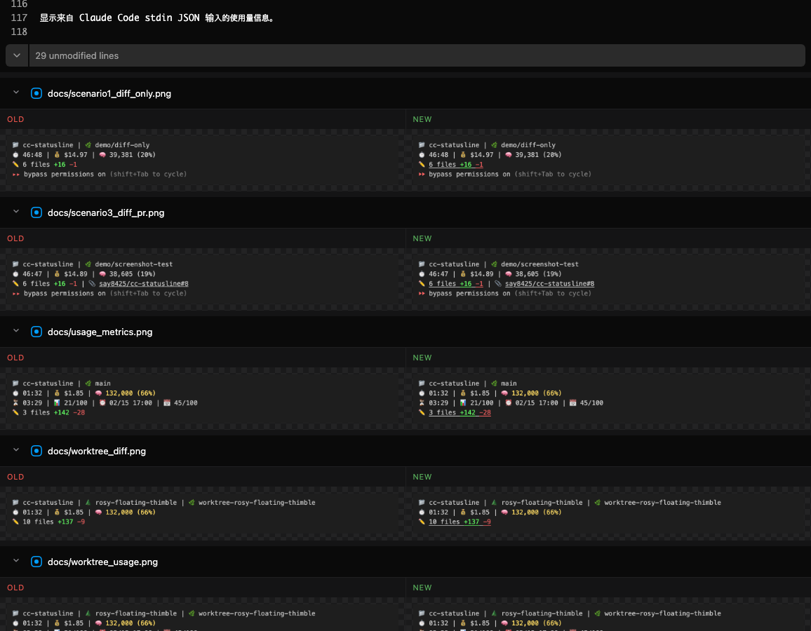

# cc-statusline

English | [한국어](docs/README.ko.md) | [日本語](docs/README.ja.md) | [中文](docs/README.zh.md) | [Español](docs/README.es.md)

Custom statusline for Claude Code.

[](https://code.claude.com/docs/en/statusline)
[](https://www.npmjs.com/package/@say8425/cc-statusline)
[](https://www.typescriptlang.org)
[](https://bun.sh)

## Installation

Add the following to `~/.claude/settings.json`:

```json
{
  "statusLine": {
    "type": "command",
    "command": "bunx @say8425/cc-statusline",
    "padding": 0
  }
}
```

## Screenshots

### Git diff only



### PR only



### Git diff + PR



### Worktree



### Worktree + Usage Metrics



### Usage Metrics



## Features

- **Session Time**: Current session elapsed time
- **Cost**: Session cost in USD
- **Context**: Token usage with percentage (color-coded)
- **Git Diff**: File count, insertions, deletions
- **Clickable Diff Viewer**: Click `✏️` to open a local diff viewer (Pierre `@pierre/diffs` + `@pierre/trees`) in your browser — file tree, working-tree / vs-base modes, watch mode (auto-refresh), file folding, and in-app search (`Cmd/Ctrl+F`) across the full diff, including deleted lines
- **PR URL**: Clickable OSC 8 hyperlink
- **Worktree Support**: Shows real project name when running in a `cc --worktree` session
- **TrueColor**: Dynamic colors based on thresholds
- **Limit Reset Time**: Reset time display (HH:MM)
- **Block Usage**: 5-hour utilization percentage
- **Weekly Reset Timer**: Weekly limit reset time (MM/DD HH:MM)
- **Weekly Usage**: 7-day utilization percentage

## Emoji Guide

| Emoji | Description              |
| ----- | ------------------------ |
| 📁    | Project folder name      |
| 🌲    | Worktree name (shown in worktree sessions) |
| 🌿    | Current Git branch       |
| ⏱️    | Session elapsed time     |
| 💰    | Session cost in USD      |
| 🧠    | Context window usage     |
| ⏳    | Limit reset time         |
| 📊    | 5-hour utilization %     |
| ⏰    | Weekly limit reset time  |
| 📅    | 7-day utilization %      |
| ✏️    | Uncommitted changes (click to open diff viewer) |
| 📎    | Pull request link        |

## Diff Viewer

Click `✏️` in the statusline to open a local diff viewer in your browser, rendered with Pierre's [`@pierre/diffs`](https://www.npmjs.com/package/@pierre/diffs) components.



> [!TIP]
> **Pairs well with [cmux](https://cmux.com)** — the viewer opens right in cmux's [browser side panel](https://cmux.com/docs/browser-automation), so your diff sits next to your terminal instead of in a separate window. cmux's built-in diff viewer felt clunky to use, which is part of why this one exists.

- **Two diff modes**: `Working tree` (vs HEAD) and `vs <base>` (merge-base against the PR target or default branch). After you commit, the entry point stays alive as `✏️ vs <base>` — clicking it opens the viewer in base mode, so your diff never disappears mid-review.



- **Image diff**: changed binary images (png/jpg/gif/webp/avif/bmp/ico) render inline in the diff flow, in the same order as the file tree — side-by-side Old/New panels on a checkerboard background, foldable like any other file


- **Unified / Split** view toggle
- **Watch mode**: auto-refresh (~2s polling) that detects changes while preserving scroll position
- **File tree**: left/right placement and flatten (collapse empty directories) toggles
- **File folding**: click any file header to collapse/expand; lockfiles and files with more than 1,500 changed lines start collapsed
- **In-app search** (`Cmd/Ctrl+F`): searches the entire diff including deleted lines, with match navigation and highlighting
- **Copy path**: hover a file header to copy the file's relative path
- **Include untracked** files toggle

### How It Works (Diff Viewer)

The statusline spawns the viewer server on demand at `127.0.0.1:49573` whenever the repo has something to show. Requests are token-protected and bound to localhost.

| Environment variable | Effect |
| -------------------- | ------ |
| `CC_STATUSLINE_DIFF_PORT` | Change the port (default: `49573`) |
| `CC_STATUSLINE_DIFF_DISABLE=1` | Disable the diff viewer entirely |

> [!TIP]
> Open the viewer through the `✏️` link instead of a bookmark — the link always carries a fresh token and makes sure the server is running.

## Usage Metrics

Shows usage information from Claude Code's stdin JSON input.

### How It Works

Claude Code passes `rate_limits` in the stdin JSON input (CLI 2.1.80+):

1. **5-hour utilization** - Usage percentage for the current billing block (`rate_limits.five_hour.used_percentage`)
2. **7-day utilization** - Weekly usage percentage (`rate_limits.seven_day.used_percentage`)
3. **Reset timer** - Exact reset time (`rate_limits.five_hour.resets_at`), shown as `HH:MM`
4. **Weekly reset timer** - Weekly limit reset time (`rate_limits.seven_day.resets_at`), shown as `MM/DD HH:MM` (e.g., `02/15 17:00`)

Usage metrics are **automatically displayed** when `rate_limits` is present in the stdin JSON. No additional flags or configuration needed.

> [!NOTE]
> `rate_limits` is only available for Claude.ai subscribers (Pro/Max) after the first API response. See the [official statusline docs](https://code.claude.com/docs/en/statusline) for the full JSON schema.

## Dependencies

- [Bun](https://bun.sh) - JavaScript runtime
- [gh](https://cli.github.com) - GitHub CLI (optional, for PR URL)

## Development

```bash
# Install dependencies
bun install

# Run tests
bun test

# Run tests with coverage
bun test --coverage

# Type check
bun run typecheck

# Lint (oxlint, type-aware)
bun run lint

# Format (oxfmt)
bun run format
```

## Color Thresholds

| Metric        | Normal (white) | Warning (yellow) | Critical (red) |
| ------------- | -------------- | ---------------- | -------------- |
| Context %     | < 50%          | 50-80%           | > 80%          |
| Block Usage % | < 50%          | 50-80%           | > 80%          |

## License

MIT
