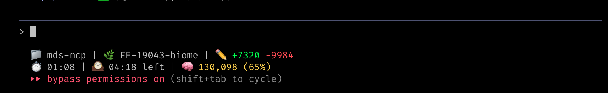
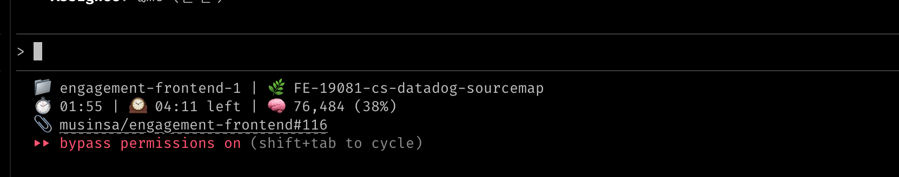

# cc-statusline

Custom statusline for Claude Code.

[](https://www.npmjs.com/package/@say8425/cc-statusline)


## Preview





## Features

- **Session Time**: Current session elapsed time
- **Context %**: Current context window usage (updates immediately)
- **Session Tokens**: Cumulative token usage
- **PR URL**: Clickable OSC 8 hyperlink
- **TrueColor**: Dynamic colors based on thresholds

## Installation

Add the following to `~/.claude/settings.json`:

```json
{
  "statusLine": {
    "type": "command",
    "command": "bunx @say8425/cc-statusline",
    "padding": 0
  }
}
```

## Dependencies

- [Bun](https://bun.sh) - JavaScript runtime
- [gh](https://cli.github.com) - GitHub CLI (optional, for PR URL)

## Color Thresholds

| Metric | Normal (white) | Warning (yellow) | Critical (red) |
|--------|----------------|------------------|----------------|
| Context % | < 50% | 50-80% | > 80% |

## License

MIT
