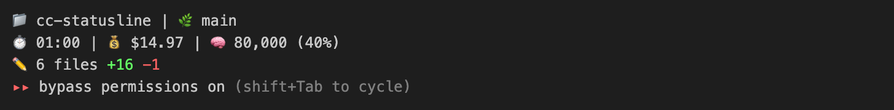
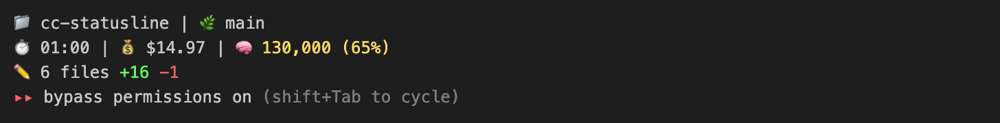
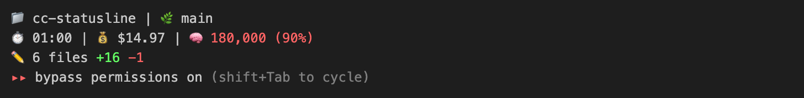
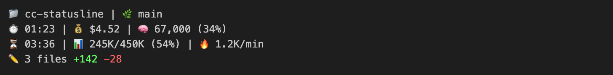

# cc-statusline

[English](../README.md) | [한국어](README.ko.md) | [日本語](README.ja.md) | [中文](README.zh.md) | Español

Línea de estado personalizada para Claude Code.

[](https://code.claude.com/docs/en/statusline)
[](https://www.npmjs.com/package/@say8425/cc-statusline)
[](https://www.typescriptlang.org)
[](https://bun.sh)

## Instalación

Agrega lo siguiente a `~/.claude/settings.json`:

```json
{
  "statusLine": {
    "type": "command",
    "command": "bunx @say8425/cc-statusline",
    "padding": 0
  }
}
```

## Capturas de pantalla

### Solo Git diff


### Solo PR


### Git diff + PR


### Context Normal (< 50%)



### Context Advertencia (50-80%)



### Context Crítico (> 80%)



### Temporizador de Reinicio de Límite



## Características

- **Tiempo de sesión**: Tiempo transcurrido de la sesión actual
- **Costo**: Costo de la sesión en USD
- **Contexto**: Uso de tokens con porcentaje (codificado por colores)
- **Git Diff**: Cantidad de archivos, inserciones, eliminaciones
- **PR URL**: Hipervínculo OSC 8 clickeable
- **TrueColor**: Colores dinámicos basados en umbrales
- **Temporizador de reinicio**: Tiempo restante hasta el reinicio del límite
- **Uso del bloque**: Uso de tokens del bloque de 5 horas con porcentaje
- **Tasa de consumo**: Tasa de consumo de tokens por minuto

## Guía de Emojis

| Emoji | Descripción                          |
| ----- | ------------------------------------ |
| 📁    | Nombre de la carpeta del proyecto    |
| 🌿    | Rama Git actual                      |
| ⏱️    | Tiempo transcurrido de sesión        |
| 💰    | Costo de sesión en USD               |
| 🧠    | Uso de ventana de contexto           |
| ⏳    | Cuenta regresiva de reinicio         |
| 📊    | Uso de tokens del bloque de 5 horas  |
| 🔥    | Tasa de consumo de tokens (por min)  |
| ✏️    | Cambios sin confirmar                |
| 📎    | Enlace de Pull Request               |

## Métricas de Uso

Muestra información de uso del bloque de facturación de 5 horas.

### Cómo Funciona

Analiza automáticamente los archivos JSONL de `~/.claude/projects/` para detectar:

1. **Mensajes de error de límite de uso** - Extrae el tiempo exacto de reinicio de errores "Claude AI usage limit reached"
2. **Bloques de facturación de 5 horas** - Calcula el tiempo de finalización del bloque basado en la última actividad (como [ccusage](https://github.com/ryoppippi/ccusage))
3. **Uso de tokens** - Suma los tokens de entrada y salida dentro del bloque actual de 5 horas
4. **Tasa de consumo** - Calcula el consumo promedio de tokens por minuto

No requiere configuración manual.

### Selección de Plan

Los diferentes planes de Claude Code tienen diferentes límites de tokens. Usa la bandera `--plan` para configurar tu plan:

```json
{
  "statusLine": {
    "type": "command",
    "command": "bunx @say8425/cc-statusline --plan max5x",
    "padding": 0
  }
}
```

| Plan | Límite de Tokens | Comando |
|------|------------------|---------|
| Pro (predeterminado) | 450K | `--plan pro` u omitir |
| Max 5x | 2.25M | `--plan max5x` |
| Max 20x | 9M | `--plan max20x` |

### Desactivar

Para ocultar la línea de métricas de uso (temporizador de reinicio, uso del bloque, tasa de consumo), usa la bandera `--no-usage`:

```json
{
  "statusLine": {
    "type": "command",
    "command": "bunx @say8425/cc-statusline --no-usage",
    "padding": 0
  }
}
```

## Dependencias

- [Bun](https://bun.sh) - Runtime de JavaScript
- [gh](https://cli.github.com) - GitHub CLI (opcional, para PR URL)

## Umbrales de Color

| Métrica        | Normal (blanco) | Advertencia (amarillo) | Crítico (rojo) |
| -------------- | --------------- | ---------------------- | -------------- |
| Contexto %     | < 50%           | 50-80%                 | > 80%          |
| Uso del bloque % | < 50%         | 50-80%                 | > 80%          |

## Licencia

MIT
