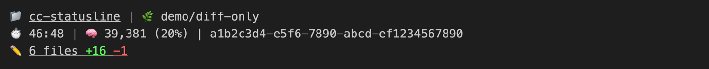
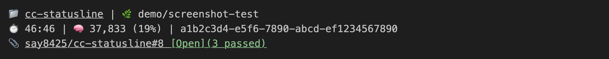
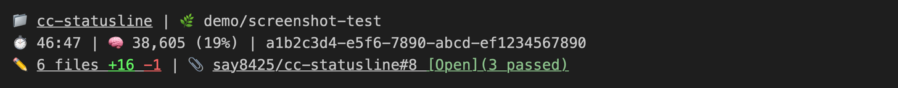
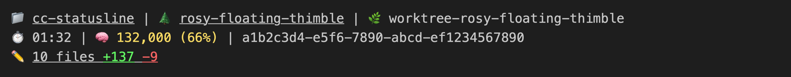
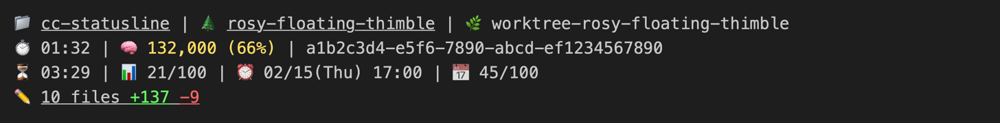
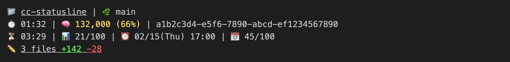
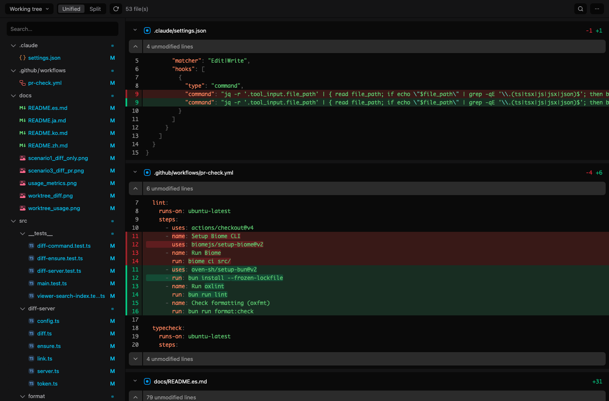
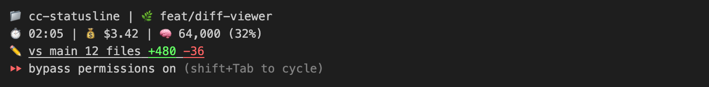
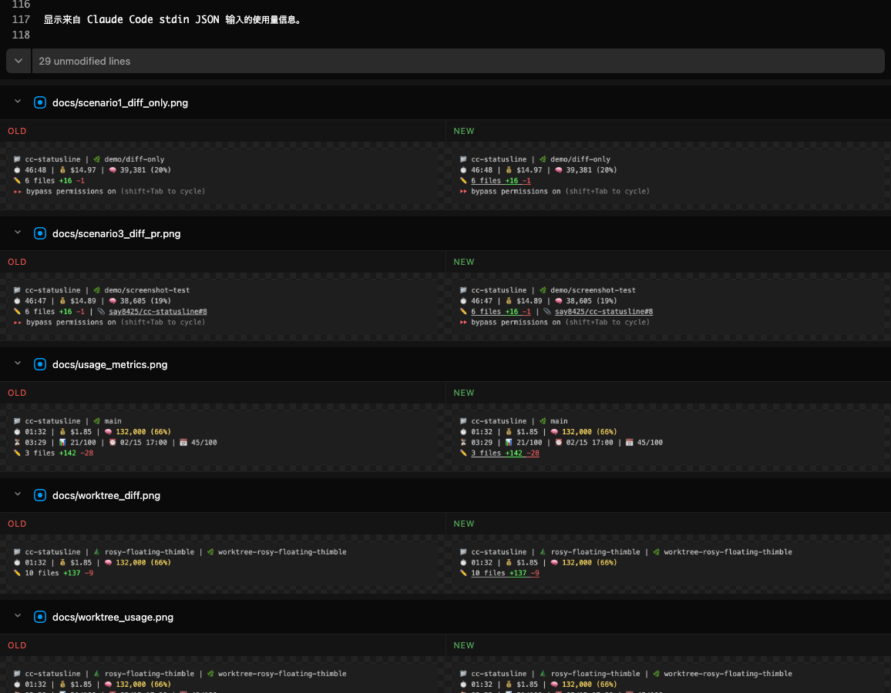

# cc-statusline

[English](../README.md) | [한국어](README.ko.md) | [日本語](README.ja.md) | 中文 | [Español](README.es.md)

Claude Code 自定义状态栏。

[](https://code.claude.com/docs/en/statusline)
[](https://www.npmjs.com/package/@say8425/cc-statusline)
[](https://www.typescriptlang.org)
[](https://bun.sh)

## 安装

将以下内容添加到 `~/.claude/settings.json`：

```json
{
  "statusLine": {
    "type": "command",
    "command": "bunx @say8425/cc-statusline",
    "padding": 0
  }
}
```

## 截图

### 仅 Git diff



### 仅 PR



### Git diff + PR



### 工作树



### 工作树 + 使用量指标



### 使用量指标



## 功能

- **会话时间**: 当前会话经过时间
- **费用**: 会话费用（美元）— 默认隐藏，设置 `CC_STATUSLINE_SHOW_COST=1` 后显示（参见[配置](#配置)）
- **上下文**: 令牌使用量及百分比（颜色标识）
- **模型**: 当前使用的模型名称和 reasoning effort（例如 `Fable 5 high`），在 ultracode 会话中显示 `⚡ultra` 徽章
- **Git Diff**: 文件数、新增、删除
- **可点击的 Diff 查看器**：点击 `✏️` 即可在浏览器中打开本地 diff 查看器（参见 [Diff 查看器](#diff-查看器)）
- **PR URL**: 可点击的 OSC 8 超链接
- **工作树支持**: 在 `cc --worktree` 会话中显示真实项目名称
- **TrueColor**: 基于阈值的动态颜色
- **重置时间**: 5小时使用量重置时间（HH:MM）
- **块使用量**: 5小时使用率
- **每周重置计时器**: 7天使用量重置时间（MM/DD(周五) HH:MM — 星期名称遵循当前区域设置）
- **周使用量**: 7天使用率
- **会话名称**: 以 `@"名称"` 形式显示本会话的提及地址 — 粘贴到其他 Claude 会话中即可向本会话发送消息

## 表情符号指南

| 表情 | 说明                |
| ---- | ------------------- |
| 📁   | 项目文件夹名（点击在文件管理器中打开） |
| 🌲   | 工作树名称（点击打开工作树文件夹） |
| 🌿   | 当前 Git 分支       |
| ⏱️   | 会话经过时间        |
| 💰   | 会话费用（美元）— 默认隐藏（参见[配置](#配置)） |
| 🧠   | 上下文窗口使用量    |
| 🤖   | 当前模型和 effort   |
| `@`   | 会话名称 — 提及地址 |
| ⏳   | 重置时间            |
| 📊   | 5小时使用率 %       |
| ⏰   | 每周限制重置时间    |
| 📅   | 7天使用率 %         |
| ✏️   | 未提交的更改（点击打开 diff 查看器）        |
| 📎   | Pull Request 链接 — 方括号中显示状态（`[Open]`/`[Draft]`/`[Merged]`/`[Closed]`），存在检查时括号中显示 CI 汇总（`(N passed)`/`(N running)`/`(N failed)`） |

## 配置

默认行为完全依赖 Claude Code 通过 stdin 传入的 JSON，无需额外配置。以下环境变量可调整渲染内容:

| 环境变量 | 效果 |
| -------- | ---- |
| `CC_STATUSLINE_SHOW_COST=1` | 显示 `💰` 会话费用段（默认: 隐藏） |
| `CC_STATUSLINE_DIFF_PORT` | 修改 diff 查看器端口（默认: `49573`） |
| `CC_STATUSLINE_DIFF_DISABLE=1` | 完全禁用 diff 查看器 |

在运行 statusline 命令的位置设置即可 — 例如在 `~/.claude/settings.json` 中:

```json
{
  "statusLine": {
    "type": "command",
    "command": "CC_STATUSLINE_SHOW_COST=1 bunx @say8425/cc-statusline",
    "padding": 0
  }
}
```

## Diff 查看器

点击 statusline 中的 `✏️`，即可在浏览器中打开本地 diff 查看器。查看器本身由 [diffdeck](https://github.com/say8425/diffdeck)（npm 上的 [`@say8425/diffdeck`](https://www.npmjs.com/package/@say8425/diffdeck)）提供，作为 cc-statusline 的运行时依赖自动安装——statusline 会将其作为后台守护进程启动，并从 `✏️` 入口链接到它。



- **两种 diff 模式**：`Working tree`（对比 HEAD）和 `vs <base>`（与 PR 目标分支或默认分支的 merge-base 对比）。提交后入口依然保留为 `✏️ vs <base>`，点击即可以 base 模式打开查看器 — 审查过程中 diff 不会消失。



- **图片 diff**：变更的二进制图片（png/jpg/gif/webp/avif/bmp/ico）按与文件树相同的顺序内联显示在 diff 流中 — 棋盘格背景的 Old/New 并排面板，可像其他文件一样折叠


- **Unified / Split** 视图切换
- **Watch 模式**：检测到变更后自动刷新（约2秒轮询），并保持滚动位置
- **文件树**：左/右布局、拖动调整宽度、flatten（折叠空目录）与隐藏侧边栏切换
- **文件折叠**：点击文件头部展开/折叠；锁文件和变更行数超过 1,500 行的文件默认折叠
- **应用内搜索**（`Cmd/Ctrl+F`）：搜索包括已删除行在内的完整 diff，支持匹配跳转和高亮
- **复制路径**：悬停文件头部即可复制文件的相对路径
- **diff-grab**：在 diff 中选择代码（拖动文本为字符级选择，行号槽的 `+` 按钮为整行），输入提示词后按 Enter — 文件路径、行范围、代码片段与提示词一并复制到剪贴板，可直接粘贴给 Claude Code 这类智能体
- **包含未跟踪文件** 开关

## 工作原理

statusline 显示的大部分信息来自 Claude Code 通过 stdin 传入的 JSON — 完整 schema 请参阅[官方 statusline 文档](https://code.claude.com/docs/en/statusline)。stdin 中没有的少数值会按下文所述从本地直接读取。

### 使用量指标

Claude Code 通过 stdin JSON 传递 `rate_limits`（CLI 2.1.80+）。只要存在该值，使用量行就会自动显示，无需额外标志或配置：

1. **5小时使用率** - 当前计费块的使用百分比（`rate_limits.five_hour.used_percentage`）
2. **7天使用率** - 周使用百分比（`rate_limits.seven_day.used_percentage`）
3. **重置计时器** - 精确重置时间（`rate_limits.five_hour.resets_at`），`HH:MM` 格式
4. **每周重置计时器** - 周限制重置时间（`rate_limits.seven_day.resets_at`），`MM/DD(星期) HH:MM` 格式。星期名称遵循由 `LC_ALL` / `LC_TIME` / `LANG` 决定的区域设置（如 `zh_CN.UTF-8` 为 `02/15(周四) 17:00`，`en_US.UTF-8` 为 `02/15(Thu) 17:00`）。若三者均无可用值（未设置、为空，或表示“不做本地化”的 `C`/`POSIX`），则回退到运行时默认区域设置（当前 Bun 为 `en-US`）。macOS 终端在未启用“Set locale environment variables on startup”时会将 `LANG` 留空

> [!NOTE]
> `rate_limits` 仅在 Claude.ai 订阅用户（Pro/Max）首次 API 响应后提供。

### 模型与 ultracode

模型名称和 effort 来自 `model.display_name` 和 `effort.level`（effort 仅对支持的模型发送）。ultracode 不在 stdin 中，因此 statusline 会读取 Claude Code 设置文件（managed → 项目 local → 项目 → 用户）中的 `ultracode` 键，并且仅当会话 effort 为 `xhigh` 时显示 `⚡ultra`。

### 会话名称

会话名称是其他 Claude 会话向本会话发送消息时使用的地址 — 通过 `/rename` 或 `claude -n` 设置的名称，否则为 `my-app-3f` 这样的默认显示名称。stdin 的 `session_name` 无法替代它：对未命名会话它保存的是 AI 生成的标题（不是提及地址），而且从不包含默认显示名称。因此 statusline 从 Claude Code 的本地会话注册表（`<CLAUDE_CONFIG_DIR 或 ~/.claude>/sessions`）读取与 `session_id` 匹配的条目。名称始终加引号，含空格或非 ASCII 字符的名称也可直接粘贴到提及中；注册表中没有该会话时隐藏。它不依赖 `rate_limits`。

### Diff 查看器

当仓库有可展示的变更时，statusline 会按需将 diffdeck 作为后台守护进程在 `127.0.0.1:49573` 启动。请求受令牌保护，且仅绑定到 localhost。

控制它的两个 `CC_STATUSLINE_DIFF_*` 环境变量集中在[配置](#配置)一节的表格中。

> [!TIP]
> 请通过 `✏️` 链接打开查看器，而不是使用书签 — 链接始终携带最新令牌，并确保服务已启动。

## 依赖项

- [Bun](https://bun.sh) - JavaScript 运行时
- [gh](https://cli.github.com) - GitHub CLI（可选，用于 PR URL）

## 颜色阈值

| 指标       | 正常（白色） | 警告（黄色） | 危险（红色） |
| ---------- | ------------ | ------------ | ------------ |
| 上下文 %   | < 50%        | 50-80%       | > 80%        |
| 块使用量 % | < 50%        | 50-80%       | > 80%        |

## 许可证

MIT
